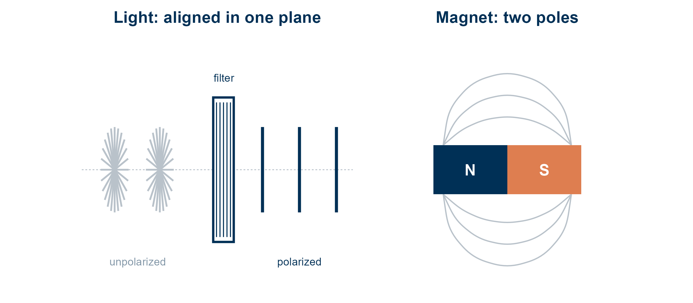
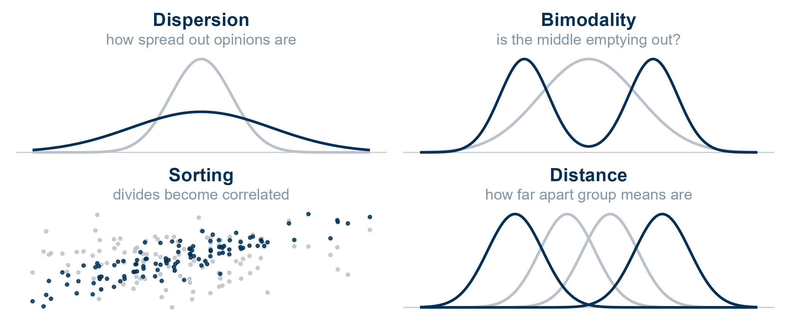
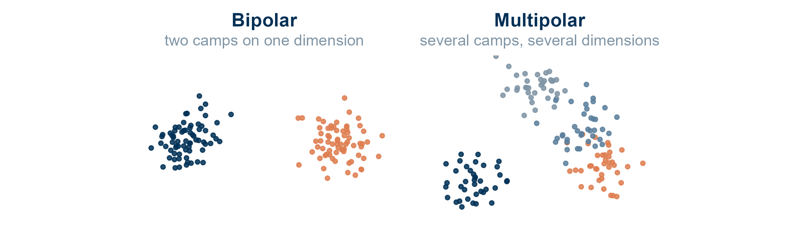
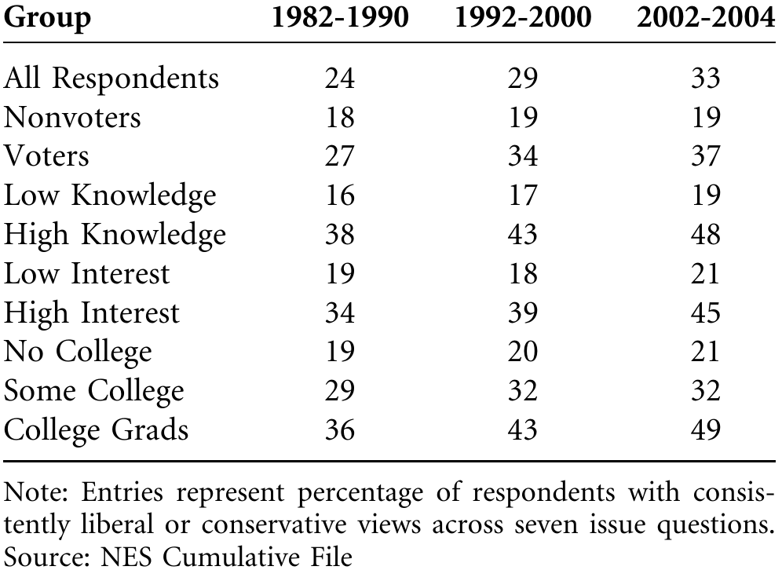
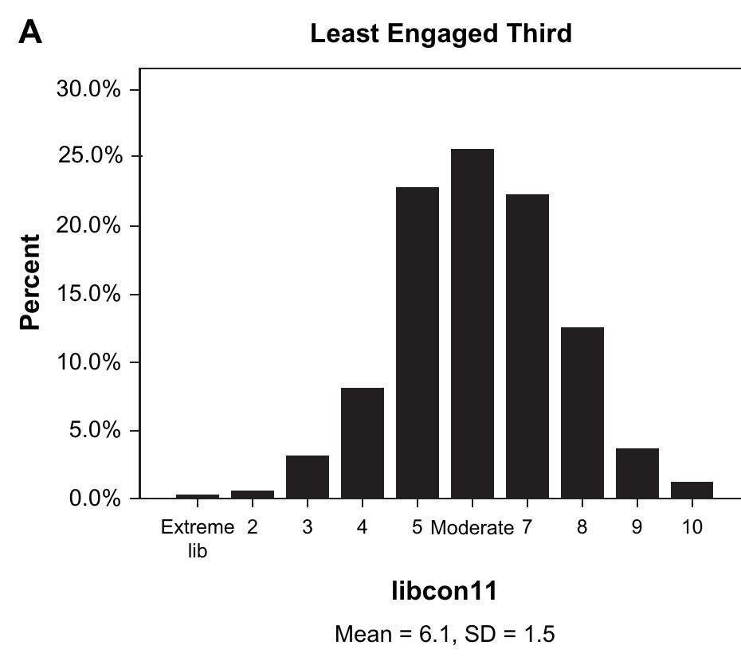
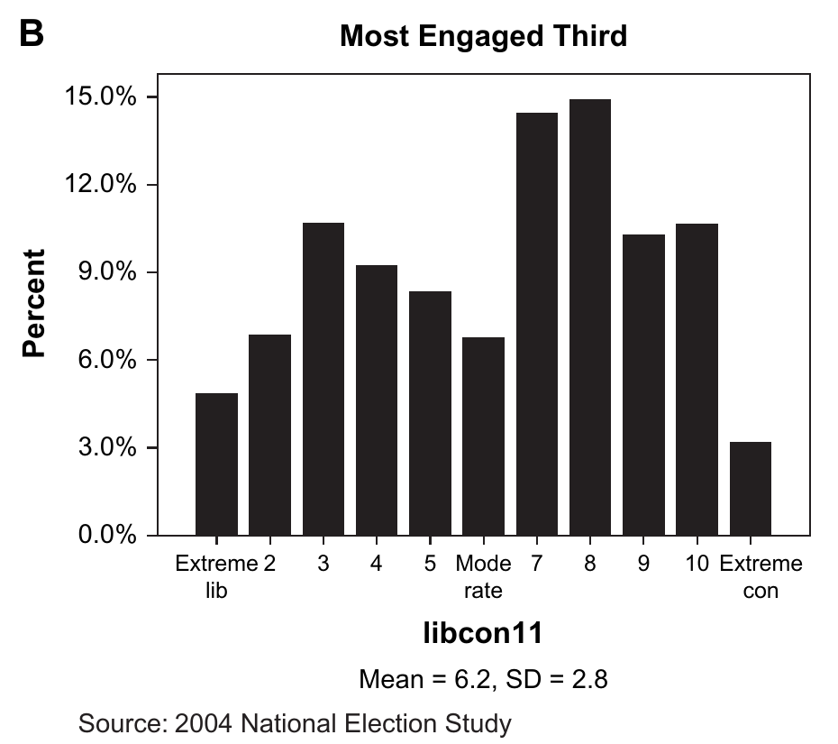
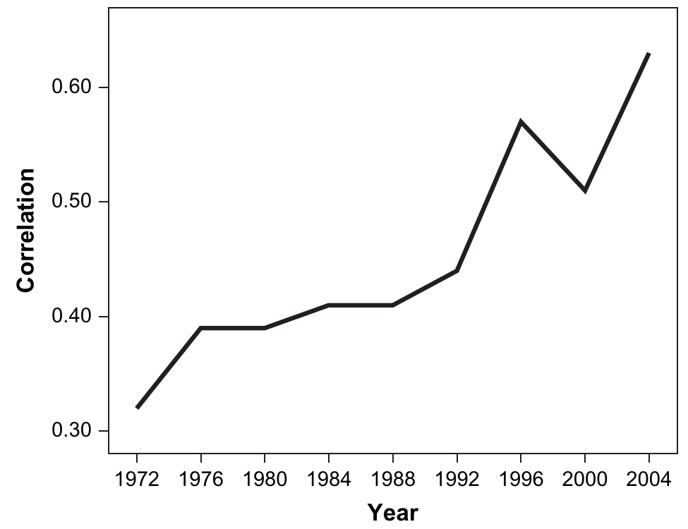
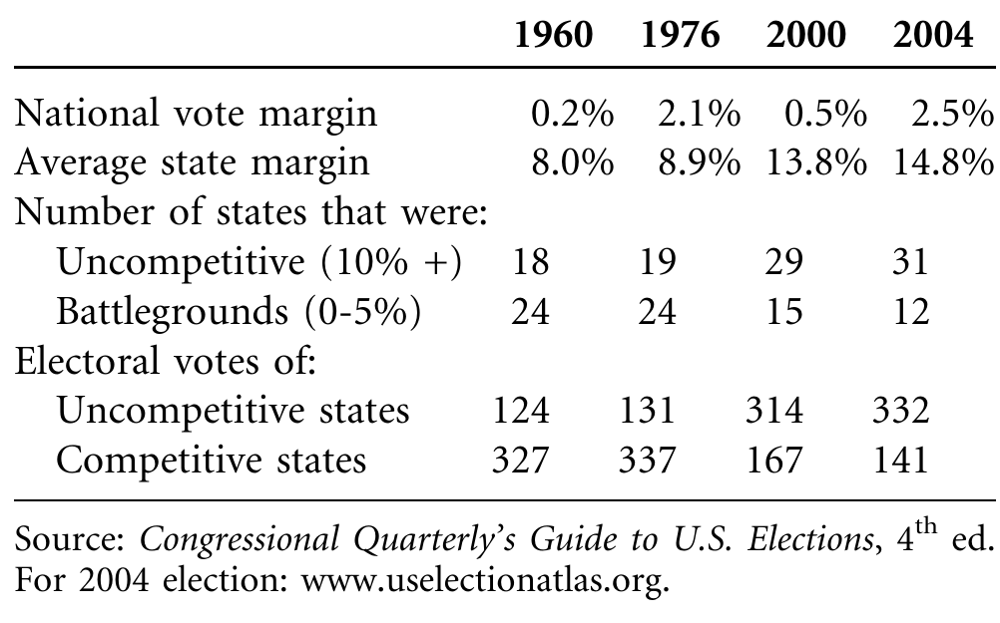
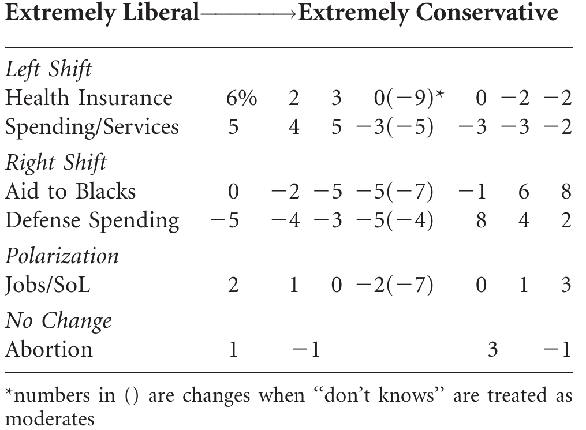
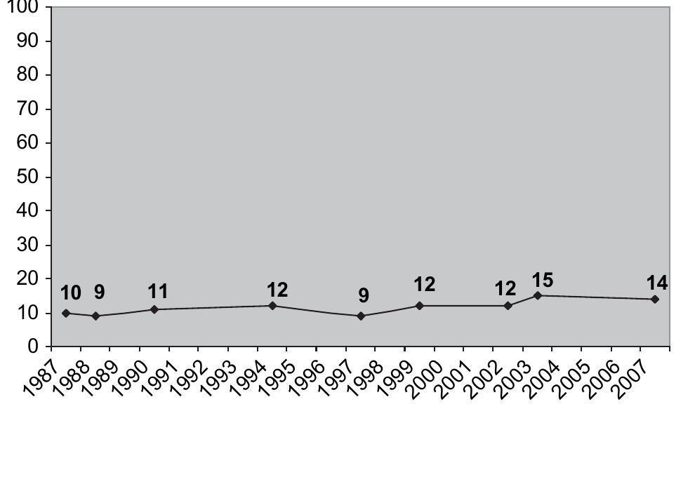

<!--
Session 03, 90 minutes. Time plan, also repeated in the notes of each section divider:

   0-5   Opening: goals, agenda
   5-20  The concept (slides 5 to 7 of the CSAP talk, figures re-rendered from its code)
  20-25  The debate: setting
  25-40  Abramowitz and Saunders (2008), five-part scheme
  40-55  Fiorina, Abrams and Pope (2008), five-part scheme
  55-80  What were they disagreeing about? Pair task 10, plenary 15
  80-90  Wrap-up: recap, next session

The learning goals are copied from course.yml (weeks, week 3). The deck runs no R, so they
are kept in step by hand, like the title.
Figure provenance and rights are listed in images/COPYRIGHTS.md.
-->

## What comes to mind? {#sec-menti .smaller}

::: notes
- 2 min, before any framing
- read three entries aloud, correct nothing
- come back to it on the family-of-concepts slide
:::

**What comes to mind when you hear the word "polarization"?**

Go to **menti.com** and enter **2832 7219**

## Session 03 goals {#sec-week03-goals}

::: notes
- read the goals aloud
- goal 2 is what the whole session builds to
:::

By the end of today, you will be able to:

1. Distinguish elite from mass polarization, and ideological divergence from issue alignment.
2. Explain why two authors can disagree about whether a public is polarized without disagreeing about any fact.
3. Identify which concept of polarization a given empirical claim depends on.

## Today {#sec-today .smaller}

::: notes
- 0 to 5 min: goals and agenda
- say once: core reading was linked wrongly at first, see syllabus
- anyone who read the Annual Review has read Fiorina's side at length
:::

1. **The concept**
   - A word borrowed from physics, and the meanings it picked up
2. **The debate**
   - Is the American public polarized? A 2008 exchange in the *Journal of Politics*
3. **Abramowitz and Saunders (2008)**
   - "Is polarization a myth?"
4. **Fiorina, Abrams and Pope (2008)**
   - "Misconceptions and misreadings"
5. **What were they disagreeing about?**
   - Pair task and discussion
6. **Wrap-up**

# The concept {#sec-concept}

::: notes
- 5 to 20 min
- frame it: every result today gets placed on this vocabulary
:::

## Borrowed from physics {#sec-physics .smaller}

::: notes
- start outside political science
- unpolarized light vibrates in every plane, a filter aligns it to one
- magnet: charge separated to two poles
- what is missing: conflict. Social science added that.
- ask: hearing "polarized society", what do you picture?
:::

- In physics, polarization is the *orientation* of a wave
- The original meaning is alignment, orientation, separation
- Nothing about conflict or hostility. Social science supplied that.

{#fig-physics fig-align="center" width="80%"}

## A family of concepts {#sec-family .smaller}

::: notes
- grey = before, navy = after
- dispersion = spread, bimodality = middle empties
- sorting = divides correlate, nobody moves on the x axis
- distance = group means
- key point: these can move in opposite directions in the same data
- flag: this figure returns in the pair task
:::

- Broadest usage: alignment, separation, sorting, divergence
- At least four mathematically distinct things share the name
- They can move in **opposite directions in the same data**

{#fig-four-dists fig-align="center" width="70%"}

## Three further axes {#sec-axes .smaller}

::: notes
- bipolar vs multipolar: US assumes two camps, Europe has seven parties
- state vs process: "is polarized" snapshot, "is polarizing" trend
- object vs target: who is polarized, and against whom?
- pivot: the third axis is where today's debate starts
:::

- Bipolar vs multipolar: nothing requires two camps
- State vs process: a snapshot vs a trend
- Object vs target: who is polarized against whom?

{#fig-bipolar fig-align="center" width="70%"}

## Elite versus mass {#sec-elite-mass .smaller}

::: notes
- elites: roll-call voting apart since the 1970s, both readings accept it
- the fight is over the mass public
- ask: what would you need to see in survey data to call a public polarized?
- collect two or three answers, keep for the pair task
:::

- **Elites** (legislators, activists): divergence since the 1970s is not disputed [@fiorina2008polarization]
- **The mass public**: does the electorate follow its elites?
- Two further distinctions sit inside that question
  - *Ideological divergence*: people move apart on issues, towards the extremes
  - *Issue alignment*: positions bundle together, and with party, without anyone moving

# The debate {#sec-debate}

::: notes
- 20 to 25 min
:::

## Is the public polarized? {#sec-debate-setting .smaller}

::: notes
- setting: red-blue maps after 2000 and 2004, "culture war" talk
- Fiorina, *Culture War?*: public moderate, only elites polarized
- A&S attack it, FAP reply in the same issue
- Annual Review: Fiorina's side at length, optional, not needed today
:::

- After 2000 and 2004: red states vs blue states, a "culture war" narrative
- *Culture War? The Myth of a Polarized America* [@fiorina2006culture]: the public is **closely** but not **deeply** divided
- *Journal of Politics* 70 (2), 2008, critique and reply back to back
  - @abramowitz2008ispolarization: "Is polarization a myth?"
  - @fiorina2008polarization: "Misconceptions and misreadings"
- Same data, same decades, opposite verdicts

# Abramowitz and Saunders (2008) {#sec-as}

::: notes
- 25 to 40 min
- fast through design, slow on results
:::

## Introduction {#sec-as-intro .smaller}

::: notes
- Converse 1964: ideological thinking confined to a small minority
- Fiorina says it still holds, A&S say the world changed
- ask: what changed since the 1950s that might make voters more ideological?
:::

- **Puzzle:** Fiorina says today's voters look like the barely ideological public @converse1964nature described for the 1950s
- But much has changed since then
  - Share with some college education: 19% in 1956, 61% in 2004
  - Party elites have moved apart for decades
- **Question:** is mass polarization a myth?
- They test five of Fiorina's claims: moderation, partisan and geographic polarization, social cleavages, and voter engagement

## Theory {#sec-as-theory .smaller}

::: notes
- three claims, one per bullet
- the engagement claim is the one that matters for the debate
- flag: "whose opinions matter most" is a normative choice of population
:::

- **Education and elite cues:** a more educated public, watching polarized elites, should think more ideologically
- **The engaged:** polarization should be deepest among the interested, informed and active, "whose opinions matter most to candidates and officeholders"
- **Mobilization:** polarization raises the stakes of an election, so it should *energize* voters, not turn them off

## Research design {#sec-as-design .smaller}

::: notes
- coding choices: collapse to lib, mod, con, don't knows to the middle, then an index
- FAP attack exactly this, ask them to remember it
:::

- **Data:** American National Election Studies 1972 to 2004, 2004 National Exit Poll
- **Ideological consistency:** seven issues, each collapsed to liberal, moderate or conservative
  - Score = |number of liberal positions minus number of conservative positions|
  - A 16-item scale for 2004, recoded to 11 points
- **Engagement:** interest, knowledge and participation, split into thirds
- **Partisan polarization:** correlation of party identification with ideology over time
- **Geography and religion:** red vs blue state voters, logit of the Bush vote on religiosity

## Results: consistency {#sec-as-results-consistency .smaller}

::: notes
- top row: 24, 29, 33
- gap: nonvoters flat 18 to 19, college grads 36 to 49
- inter-item correlation .20, .26, .32
- name the concept: constraint
:::

{#fig-as-consistency fig-align="left" height="385"}

- The average correlation between the seven items rises from .20 to .26 to .32

## Results: the engaged {#sec-as-results-engaged .smaller}

::: notes
- same mean 6.1 vs 6.2, SD 1.5 vs 2.8
- ask: is the right panel bimodal? mass both sides, dip at the middle
- consistent lib/con: 13 and 19 left, 32 and 39 right
:::

:::: {.columns}

::: {.column width="50%"}
{#fig-as-least-engaged height="345"}
:::

::: {.column width="50%"}
{#fig-as-most-engaged height="345"}
:::

::::

- Same mean, nearly double the spread. The engaged third is 37% of respondents and close to half of all voters.

## Results: sorting {#sec-as-results-party .smaller}

::: notes
- r = .32 in 1972, .44 in 1992, .63 in 2004
- among the engaged .47 to .77
- ask: dispersion, bimodality, sorting or distance? answer: sorting
:::

{#fig-as-correlation fig-align="left" height="380"}

- Among the engaged the same correlation runs from .47 to **.77**, and the gap between the parties' mean ideology doubles

## Results: geography {#sec-as-results-geography .smaller}

::: notes
- middle rows: battlegrounds 24, 24, 15, 12
- uncompetitive states 18 to 31
- national margin tiny, average state margin nearly doubles
- flag: FAP say election returns cannot measure polarization at all
:::

{#fig-as-battlefield fig-align="left" height="360"}

## Results: other evidence {#sec-as-results-other .smaller}

::: notes
- quick, one number each
- also results FAP rule out as evidence, hold that thought
:::

- **Religion:** among white voters, religiosity predicts the Bush vote better than any other social characteristic
  - P(Bush vote) .34 for the least religious, .81 for the most religious
- **Engagement in 2004:** turnout 54% to 61%, persuasion attempts 32% to 48%
  - Voters feeling strongly about Bush, either way, were the most likely to vote and campaign

## Conclusion {#sec-as-conclusion .smaller}

::: notes
- read the Pogo line
- it sums up their reading of the whole debate
:::

- Polarization is **not** just an elite phenomenon
- The centre is held by the least interested, informed and active
- Elite divisions "reflect real divisions within the American electorate"
- Polarization **energizes** the electorate rather than turning it off

> "We have met the enemy and he is us" [@abramowitz2008ispolarization, quoting Pogo]

# Fiorina, Abrams and Pope (2008) {#sec-fap}

::: notes
- 40 to 55 min
- same five parts
:::

## Introduction {#sec-fap-intro .smaller}

::: notes
- first move: rule out a class of evidence before replying
- ask: do you accept that a vote cannot show polarization?
- keep it short, the pair task returns to it
:::

- A point-by-point reply to the five criticisms
- **Before the reply, a rule about evidence:**
  - Votes, election returns and approval ratings "can not be used as evidence of polarization, for or against"
- Everything else follows from that rule and from one definition

## Theory {#sec-fap-theory .smaller}

::: notes
- board sketch: same voters, candidates differ first on economics, then on morals
- the vote divides along whichever dimension the candidates chose
- the voters did not change, the candidates did
:::

- **Polarization** = movement from the centre towards the extremes, so the test is rising **bimodality**
- **Sorting** is something else: party groups grow more distinct while the overall distribution stays put
- Centrist voters register polarized **choices** when the candidates polarize, without moving themselves
- So a changed relationship in the data may sit on the candidates' side, not the voters'

## Research design {#sec-fap-design .smaller}

::: notes
- contrast: FAP raw distributions, A&S recoded indices
- name it: a measurement disagreement, not a definitional one
:::

- **Raw distributions** instead of recoded and aggregated indices
- Ideological self-placement in three surveys: NES, GSS and Gallup, 1970s to 2000s
- The same NES issue scales as A&S, compared position by position, 1984 vs 2004
- Pew Research Center: party differences on 40 items, 1987 to 2007
- Abortion positions of strong partisans in 2004

## Results: raw data {#sec-fap-results-raw .smaller}

::: notes
- jobs and standard of living: centre down 2, left up 3, right up 4
- the only issue with any polarization
- the rest shift as a whole, or not at all
- brackets: don't knows as moderates, A&S's coding choice
:::

{#fig-fap-table fig-align="left" height="410"}

- Only jobs and standard of living loses its centre to **both** extremes

## Results: limited sorting {#sec-fap-results-sorting .smaller}

::: notes
- Pew line: 10 to 14 points over 20 years
- sorting granted, but far less than among elites
- ask: does a 4 point move over 20 years look like polarization?
:::

{#fig-fap-pew fig-align="left" height="420"}

- Party sorting "certainly has occurred", but far less than among elites

## Results: the rest {#sec-fap-results-rest .smaller}

::: notes
- abortion: the textbook sorting case, still a third and two fifths out of step
- one NES issue splits red and blue majorities: homosexual adoption
- mobilization, not polarization, for 2004: a factual disagreement
- religion vs class: they deny ever making the claim
:::

- **Abortion, 2004:** a third of strong Democrats and two fifths of strong Republicans break with their party's position
- **Red vs blue states:** majorities disagree on **one** NES issue, homosexual adoption
- **2004 turnout:** the parties' ground game rather than polarization, with party contacts up 8 points
- **Religion vs class:** A&S attribute a claim to them that they say they never made

## Conclusion {#sec-fap-conclusion .smaller}

::: notes
- one line: sorting yes, polarization no
- ask: after both papers, what do they agree on? put it on the board
- you need that list for the pair task
:::

- Without "multiple recodings and aggregations", the A&S case "disappears"
- **Sorting yes, polarization no**
- Red-blue divides are a "misleading exaggeration"
- 2004 engagement rests on one election and ignores mobilization
- "No reason to revise the conclusions of *Culture War?*"

# What were they disagreeing about? {#sec-disagreement}

::: notes
- 55 to 80 min
- definitions 3 min, pair task 10 min, plenary 12 min
:::

## Two definitions {#sec-what-counts .smaller}

::: notes
- read both quotations out
- FAP: shape of one distribution. A&S: subgroups inside it.
- neither is wrong about the data
- put the question to the room before the pair task
:::

> "adopting the common sense notion of polarization as a movement from the center toward the extremes, one searches in vain for evidence of increasing bimodality" [@fiorina2008polarization]

. . .

> "the existence of polarization in a society does not just depend on the overall distribution of political attitudes among the public. It also depends on whether there are differences between the views of important subgroups" [@abramowitz2008ispolarization]

. . .

- One asks about the **shape of a distribution**, the other about **differences between groups inside it**

## Pair task {#sec-pair-task .smaller}

::: notes
- 10 min, in pairs
- put the four-panel figure back up if asked
- walk around, push "both are right" pairs to say about what
:::

For each claim, note what **evidence** each side uses and which **concept** from @fig-four-dists or the three axes it rests on.

1. "The public is more polarized than in the 1980s."
2. "Democrats and Republicans are further apart."
3. "The public is polarized where it counts."
4. "Voters are divided: look at the red and blue map."
5. "The data show it."

Then decide: is the disagreement about a **definition**, a **measurement** or a **fact**?

## The mapping {#sec-mapping .smaller}

::: notes
- reveal only after the pairs report
- row by row: pairs first, table second
:::

::: {.small}
| Claim | A&S look at | FAP look at | What is at stake |
|---|---|---|---|
| The public is polarized | Consistency across issues, 24 to 33% | Each item's raw distribution, the middle holds | Constraint vs bimodality |
| The parties are further apart | Party ID and ideology, r .32 to .63 | The same fact, called sorting | Sorting vs polarization |
| Polarized where it counts | The engaged third, SD 2.8 | The public as a whole | Which population |
| Voters are divided | Votes, approval, red vs blue states | Not evidence, it reflects the candidates | Choices vs positions |
| The data show it | Recoded items, don't knows as moderates, an index | Raw position-by-position change | Measurement |

: Five disputed claims in the 2008 exchange, the evidence each side uses for them, and the concept or measurement choice the disagreement turns on. {#tbl-mapping}
:::

## Three kinds of dispute {#sec-three-kinds .smaller}

::: notes
- this answers goal 2
- stress: they agree on most facts
- elites diverged, sorting happened, self-placement barely moved
- what is left: mostly naming, some coding, a little fact
:::

- **Mostly definitional:** both accept that party sorting happened. They disagree about whether to call it polarization.
- **Partly measurement:** coding "don't knows" as moderates and aggregating items into an index change the answer
- **A little substantive:** was 2004 turnout driven by polarization or by party mobilization? Does religion outweigh class?

. . .

::: {.callout-important}
**"Is the public polarized?" has no answer until you say what you mean with "polarization".**
Two authors can read the same data and reach opposite verdicts, because they are measuring different concepts.
:::

## Questions for the group {#sec-questions .smaller}

::: notes
- plenary to 80 min
- pick two, not all four
- the last one bridges to next week
:::

- If both sides accept that sorting happened, what exactly is left to disagree about?
- Is a public polarized if its engaged third is? Whose opinions should count?
- If votes cannot show polarization, what evidence could?
- Does any of this travel to a multiparty system like Germany's?

# Wrap-up {#sec-wrap-up}

::: notes
- 80 to 90 min
:::

## Recap: takeaways {#sec-recap .smaller}

::: notes
- ask for one takeaway before revealing the list
:::

- **Polarization is a family of concepts:** dispersion, bimodality, sorting, distance, plus three axes
- **Elites diverged** without dispute. The contested question is the mass public.
- **A&S** find rising consistency and sorting, deepest among the engaged
- **FAP** find a stable middle and call the rest sorting
- Most of the dispute is about **which concept** and **which population**, some about coding, little about facts

## Recap: learning goals {#sec-recap-goals .smaller}

::: notes
- goal by goal
- ask for each answer before revealing it
:::

**Goal 1. Elite vs mass, divergence vs alignment**

- Elite polarization concerns office holders and activists, mass polarization the electorate
- Divergence means moving towards the extremes. Alignment means positions bundling together, and with party.

**Goal 2. Disagreeing without disagreeing about a fact**

- A&S and FAP largely agree on the facts, but attach the word to different concepts and populations

**Goal 3. Which concept a claim depends on**

- Ask what distribution changed, in whom, and whether it is positions or choices

## Next session {#sec-next-session}

::: notes
- 1 min
- sell the move: from what people think to how they feel
:::

- **Session 04: What is affective polarization?**
- From where people *stand* to how they *feel* about the other side
- Core reading: @iyengar2015fear and @wagner2024affectiveeurope

## Before you go {#sec-term-paper-note .smaller}

::: notes
- say it out loud even if the session overran
- they cannot find this out late
- point at the syllabus, no format questions here
:::

- The term paper is **empirical**: it confronts a claim with data you analyse yourself
- It is **two things**: the written paper, and the code that reproduces its analysis
- **Any technology**, R, Python, Stata or anything else. Nothing is prescribed.
- What is required is that a result comes out of a **script that runs again**, not out of clicks nobody can retrace
- The detail is in the [syllabus](../syllabus.html#sec-term-paper)

::: {.callout-note}
**Two voluntary platforms, neither needed to pass.**
[DataCamp](../syllabus.html#sec-practice-materials) gives you six months of premium access through
the course group, for self-paced practice in R and data analysis.
[Duolingo Math](https://www.duolingo.com/math) is there if you want to warm up the maths.
:::

## References {#sec-references .smaller .scrollable}

<!-- .scrollable is allowed here only because this is the reference slide (STYLE.md §5.1). -->

::: {#refs}
:::
