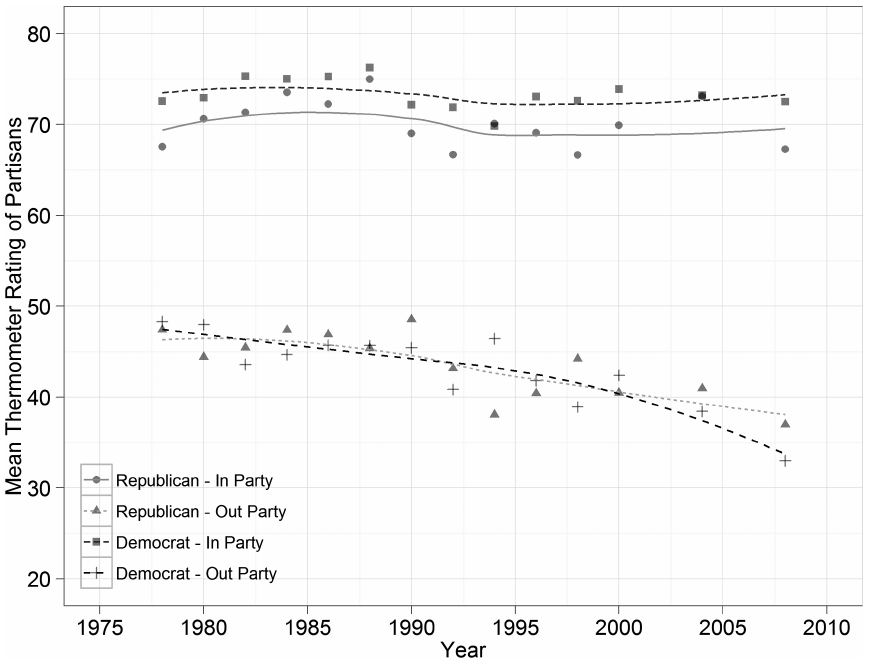
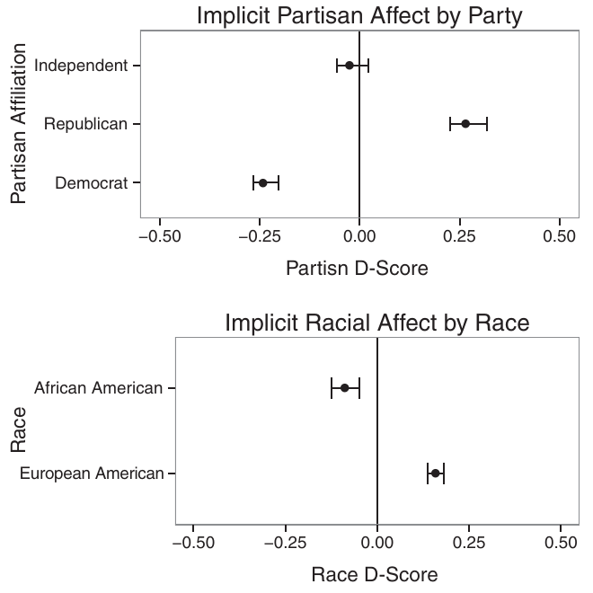
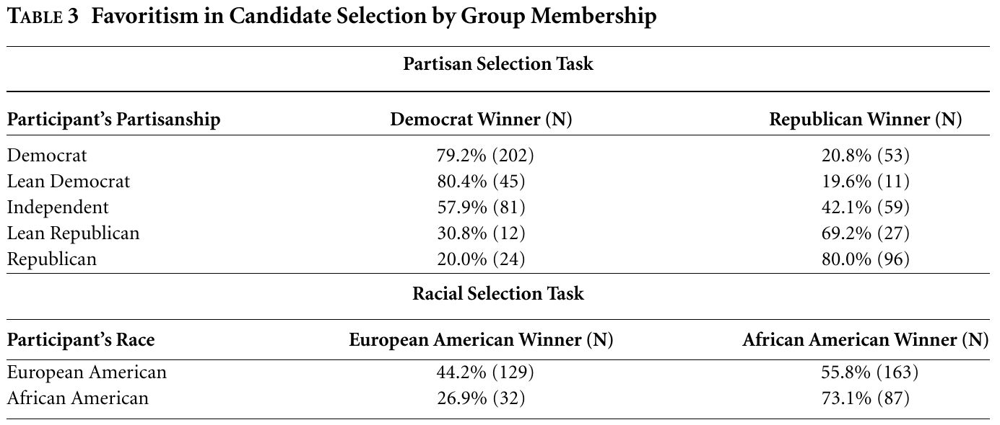
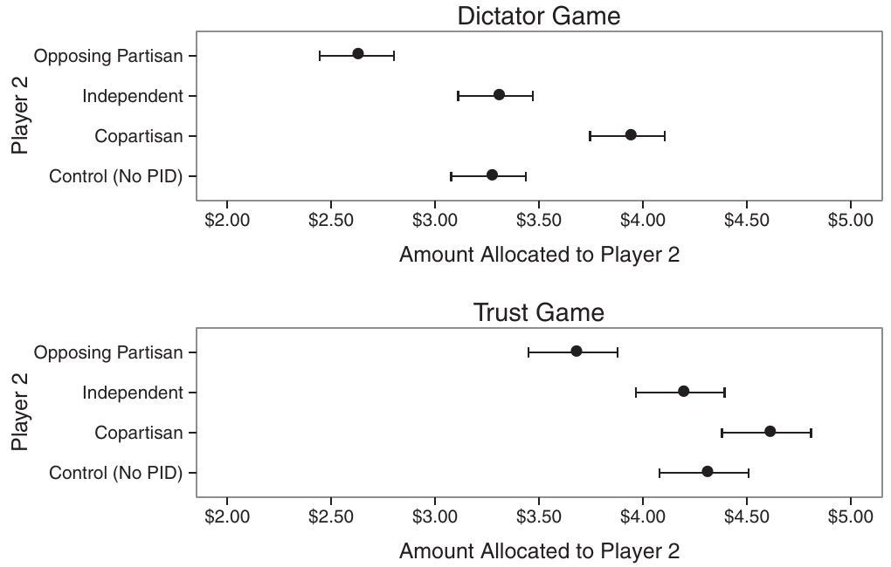

<!--
Session 04, 90 minutes. Time plan, also repeated in the notes of each section divider:

   0-5   Opening: goals, agenda
   5-15  Why groups? The evolutionary reading
  15-25  Categories in the head
  25-40  Social identity theory: favouritism and derogation
  40-55  Iyengar, Sood and Lelkes (2012), five-part scheme
  55-75  Iyengar and Westwood (2015), five-part scheme
  75-85  Questions for the group
  85-90  Wrap-up: recap, next session

The learning goals are copied from course.yml (weeks, week 4). The deck runs no R, so they
are kept in step by hand, like the title.
Figure provenance and rights are listed in images/COPYRIGHTS.md.
-->

## Session 04 goals {#sec-week04-goals}

::: notes
- read the goals aloud
- goal 1 is the first half of the session, goals 2 and 3 the two papers
:::

By the end of today, you will be able to:

1. Derive in-group favouritism and out-group hostility from social identity theory.
2. Explain what affective polarization claims to add to an ideological account of division.
3. Assess the evidence that partisan animus shows up in implicit attitudes and behavior, and not only in what people say in surveys.

## Today {#sec-today .smaller}

::: notes
- 0 to 5 min: goals and agenda
- bridge from last week: from where people *stand* to how they *feel*
:::

1. **Why groups?**
   - An evolutionary reading
2. **Categories in the head**
   - Why we see borders where there are none
3. **Social identity theory**
   - Ingroup favouritism and outgroup derogation
4. **Iyengar, Sood and Lelkes (2012)**
   - "Affect, not ideology"
5. **Iyengar and Westwood (2015)**
   - "Fear and loathing across party lines"
6. **Wrap-up**

# Why groups? {#sec-why-groups}

::: notes
- 5 to 15 min
- frame it: before parties, before politics, there are groups
:::

## Group membership {#sec-group-membership .smaller}

::: notes
- we are group animals
- belonging was a matter of survival, not preference
- Baumeister and Leary: people form bonds readily and resist losing them, across cultures
- Dunbar: primate group size tracks neocortex size, humans sit at the top end
- ingroup vs outgroup: who shares food, who is a threat
- TODO: one concrete example to open with
:::

- Belonging is a fundamental human need, not a taste [@baumeister1995need]
- Our large brains co-evolved with living in large groups [@dunbar1993coevolution]
- A group means an **ingroup** (share, cooperate) and an **outgroup** (compete, beware)

## An old species {#sec-evolution .smaller}

::: notes
- *H. sapiens* recognisable in Africa by about 315k years ago (Jebel Irhoud)
- the old "behaviourally modern since ~50 to 70k" story is contested: McBrearty and Brooks find modern behaviours building up gradually in the African Middle Stone Age
- so do not put a hard 70k number on the board
- foragers today: mean band about 28 adults, mostly unrelated (32 societies)
- settled mass societies are a very recent add-on
- point: a mind tuned to bands now lives in mass democracies
- TODO: timeline figure?
:::

- *Homo sapiens* is roughly **300,000** years old [@hublin2017new]
- Modern behaviour built up gradually, with no sudden "revolution" [@mcbrearty2000revolution]
- For almost all of that time: small, mobile bands of a few dozen adults [@hill2011coresidence]
- The same minds now live in democracies of millions

# Categories in the head {#sec-categories}

::: notes
- 15 to 25 min
- framing borrowed from Sapolsky [-@sapolsky2017behave], introduction and chapter 11
- the claims on the slides rest on the primary studies
:::

## Invented borders {#sec-sapolsky .smaller}

::: notes
- Tajfel and Wilkes: eight lines of different length
- labelled A (short four) and B (long four): people exaggerate the gap between A and B
- and see lines within A, within B, as more alike
- no labels, or random labels: no distortion
- the category does the work, not the stimulus
:::

Once we sort a continuum into categories, we

- **overestimate** differences *between* categories
- **underestimate** differences *within* them

. . .

Label lines "A" and "B", and people see the gap between A and B as larger [@tajfel1963classification]

## The colour example {#sec-colour .smaller}

::: notes
- light is a continuous spectrum of wavelengths
- colour names are cuts we make in it, languages cut differently
- ask: where exactly does blue end?
:::

- The spectrum is continuous
- The colour names, and the borders between them, are ours

{#fig-spectrum fig-align="center" width="90%"}

## From categories to bias {#sec-categories-to-bias .smaller}

::: notes
- transfer to people: once "us" and "them" exist, the same distortion applies
- Quattrone and Jones: Princeton vs Rutgers students, rival school seen as more alike
- them: all alike, very different from us
- us: all individuals
- leads into SIT: categorisation is its first step
:::

- The same distortion, applied to people
- *Them*: all alike, and very unlike us
- *Us*: a collection of individuals [@quattrone1980perception]

# Social identity theory {#sec-sit}

::: notes
- 25 to 40 min
- start from the evolutionary history just covered
:::

## Tajfel and Turner {#sec-tajfel-turner .smaller}

::: notes
- social identity: the part of the self-concept that comes from group membership
- categorisation: sort people, self included
- identification: take the group on as part of who I am
- comparison: judge us against them
- positive distinctiveness: we want our group to look good next to others
:::

Social identity is the part of the self that comes from group membership [@tajfel1986integrative]

1. **Categorisation**: sort people, yourself included
2. **Identification**: the group becomes part of who you are
3. **Comparison**: judge *us* against *them*

. . .

We seek **positive distinctiveness**: our group should look better

## Minimal groups {#sec-minimal-groups .smaller}

::: notes
- Klee vs Kandinsky, or dot estimation
- schoolboys, groups with no history, no interaction, no stakes, anonymous
- still: allocate more to own group, even give up absolute gain to maximise the gap
- Billig and Tajfel: works even when assignment is openly random
- point: the category alone is enough
:::

- Assign people to groups on a trivial basis: Klee vs Kandinsky, dot estimates
- No history, no contact, no self-interest at stake
- People still favour their own group, and even trade gains to **widen the gap** [@tajfel1970experiments; @tajfel1971social]
- It works even when assignment is openly random [@Billig1973social]

## Two kinds of bias {#sec-favouritism-derogation .smaller}

::: notes
- ingroup favouritism: liking and helping us
- outgroup derogation: disliking and hurting them
- Brewer: not the same thing, ingroup love does not require outgroup hate
- Balliet et al., meta-analysis of cooperation games: d = 0.32, and the gap is mostly ingroup favouritism
- hold this: Iyengar and Westwood find the opposite for party
- ask: which of the two is more dangerous for democracy?
:::

- **Ingroup favouritism**: liking and helping *us*
- **Outgroup derogation**: disliking and hurting *them*
- Distinct, and the first does not require the second [@brewer1999psychology]

. . .

- In cooperation experiments, discrimination is mostly ingroup love [@balliet2014ingroup]
- Keep this in mind for Iyengar and Westwood

## Party as identity {#sec-party-identity .smaller}

::: notes
- bridge to the readings
- if party is a group like any other, SIT predicts affect, not only disagreement
- that is the claim of affective polarization
- the definition: Iyengar and Westwood, restated in the Annual Review
- two parts, not one: ingroup favouritism **and** outgroup animosity, back to the last slide
- "people identifying as partisans": somebody has to decide who counts
:::

- If a party is a group like any other, partisans are an *us*
- Then SIT predicts **affect**, not only disagreement: warmth for our side, hostility for theirs

> "the tendency of people identifying as \[partisans\] to view opposing partisans negatively and copartisans positively" [@iyengar2015fear, 691; @iyengar2019origins]

# Iyengar, Sood and Lelkes (2012) {#sec-isl}

::: notes
- 40 to 55 min
- five-part scheme, as last week
:::

## Introduction {#sec-isl-intro .smaller}

::: notes
- links to last week: the Abramowitz vs Fiorina debate is about ideology
- their move: look at affect instead
- social distance: Bogardus, how close would you let a member of group X come?
:::

- Last week's debate asked whether *policy views* have moved apart
- ISL: that is the wrong test
- Look at how partisans **feel** about each other, as **social distance** [@bogardus1947measurement]

## Theory {#sec-isl-theory .smaller}

::: notes
- SIT applied to parties: identity implies ingroup warmth *and* outgroup hostility
- salience: the more salient the identity, the more biased
- campaigns: louder, longer, more negative since the 1970s
- partisan cable news confirms stereotypes
:::

- Party identification is a social identity
- Identity implies warmth for *us* and coldness toward *them*
- Campaigns make the identity **salient**, and negative ads feed the dislike

## Research design {#sec-isl-design .smaller}

::: notes
- six surveys, 1960 to 2010
- ANES thermometers 0 to 100, 1978 to 2008
- traits: intelligent, selfish, closed-minded ...
- marriage: "how would you feel if your son or daughter married a ...?"
- UK as a stringent baseline: class-rooted parties, should be *more* polarized
- two explanations tested: policy attitudes, campaign exposure (battleground states, 2004 attack ads, 2008 panel)
:::

- **Thermometers**: how warm do you feel toward each party? (ANES, 1978 to 2008)
- **Social distance**: traits of party supporters, a child marrying across party lines
- **Comparison**: United States vs United Kingdom, 1960 vs 2008 and 2010
- **Explanations**: policy attitudes, exposure to campaigns

## Results: thermometers {#sec-isl-results-thermo .smaller}

::: notes
- in-party flat, around 70
- out-party down about 15 points since 1988, just above 30 in 2008
- compare: Protestants rate Catholics 66, Republicans rate "people on welfare" 50
- same flat pattern for liberals and conservatives: party, not ideology
:::

{#fig-isl-thermometers fig-align="left" height="380"}

- It is the *out-party* that has changed

## Results: social distance {#sec-isl-results-marriage .smaller}

::: notes
- 1960: 4 to 5% of US partisans displeased by an out-party marriage
- 2008: 20 to 27%, 2010: 33 to 49%
- UK: modest rise, now below the US
- reversal: in 1960 the British cared more
- policy attitudes predict affect only modestly, cultural issues not at all
- campaigns: battleground residents polarize faster in 2008, small effect of attack ads
:::

{#fig-isl-marriage fig-align="left" height="360"}

- Policy views explain little of this, campaigns a little

## Conclusion {#sec-isl-conclusion .smaller}

::: notes
- affect, not ideology: dislike grows even where issue positions barely move
- partisanship is an affective attachment, acquired early and stable
- worry: losers who despise the winners may not accept their decisions as legitimate
- ask: is this a US story? the UK comparison says partly
:::

- **Affect, not ideology**: Americans dislike the other side more, without disagreeing much more
- Partisanship is an affective bond more than a set of views
- Risk: opponents' decisions may stop counting as legitimate

# Iyengar and Westwood (2015) {#sec-iw}

::: notes
- 55 to 75 min
- same five parts
:::

## Introduction {#sec-iw-intro .smaller}

::: notes
- survey answers could be cheap talk, or filtered
- question: does animus show up where people cannot or do not control it?
- and in choices outside politics?
:::

- ISL showed what partisans *say*
- Survey answers can be filtered or exaggerated
- Does animus show up where people **cannot hide it**, and in **nonpolitical choices**?

## Theory {#sec-iw-theory .smaller}

::: notes
- race as the benchmark: the deepest divide in American society
- norms suppress open racial bias
- no norm suppresses partisan bias, elites model hostility
- H1: partisan affect implicit, H2: partisan bias at least as large as racial
- H3: partisans discriminate in nonpolitical choices, H4: more out-group hostility than in-group favour
:::

- Benchmark: **race**, the deepest American divide
- Social norms restrain racial bias, no norm restrains partisan bias
- Expect partisan bias to be automatic, as large as racial bias, and driven by **dislike** of the out-party

## Research design {#sec-iw-design .smaller}

::: notes
- all online SSI samples, 2012 and 2013
- Study 1: brief implicit association test, party and race, N about 2,000
- Study 2: pick one of two high-school seniors for a scholarship, cue is Young Democrats / Young Republicans or a racially typical name, GPA varied, N about 1,000
- Study 3: trust and dictator games, player 2's party and race crossed, N about 800
- Study 4: add a no-party control and an independent, to separate favour from hostility
:::

1. **Implicit**: reaction-time test of party and race associations
2. **Scholarship**: choose between two students, one cue for party or race, grades varied
3. **Games**: split \$10 with a copartisan or opponent, same or other race
4. **Games with a control**: separate favour for *us* from hostility to *them*

## Results: implicit bias {#sec-iw-results-implicit .smaller}

::: notes
- D-score: positive = faster pro-Republican associations
- gap between parties: d = .95, between races: d = .61
- implicit correlates with thermometers, r = .42
- thermometer gap even larger, d = 1.72: saying it out loud *adds* polarization
:::

{#fig-iw-dscores fig-align="left" height="370"}

- The party gap is **larger** than the race gap, even implicitly

## Results: behaviour {#sec-iw-results-behaviour .smaller}

::: notes
- scholarship: about 80% of partisans pick their own side, leaners too
- GPA made no significant difference: co-partisan chosen even when less qualified
- race: only African Americans favour their own, whites slightly favour the Black student
- games: copartisans get more, race makes no difference
:::

{#fig-iw-scholarship fig-align="left" height="330"}

- Party trumps merit, race barely registers

## Results: love or hate? {#sec-iw-results-games .smaller}

::: notes
- control: no party information
- dictator: copartisan +\$0.67, opponent -\$0.63
- trust: copartisan +\$0.30, opponent -\$0.63, penalty about twice the bonus
- independents treated like the control
- contrast with Balliet et al.: here it is out-group hostility
:::

{#fig-iw-games fig-align="left" height="350"}

- In the trust game the penalty for opponents is about **twice** the bonus for copartisans

## Conclusion {#sec-iw-conclusion .smaller}

::: notes
- ask: what does behaviour show that a thermometer cannot?
- partisans, unlike racists, face no sanction
- party is chosen, so people are blamed for it
- elites who cooperate look like appeasers, so taunting pays
- limitation: in the studies party is revealed, in real life it must be discerned
:::

- The party divide is as deep as race, or deeper, and it reaches **nonpolitical** choices
- It is **permitted**: no norm restrains it
- Hostility toward *them* outweighs favour for *us*
- Elites have an incentive to fight rather than cooperate

# Discussion {#sec-discussion}

::: notes
- 75 to 85 min
:::

## Questions {#sec-questions .smaller}

::: notes
- pick two, not all
- Q1 is goal 2, Q2 goal 3, Q3 goal 1
- Q3 hook: Balliet et al. find mostly ingroup love, Iyengar and Westwood find outgroup hate
:::

1. If partisans barely disagree more but dislike each other more, what is the "polarization" in affective polarization?
2. Is a scholarship choice or a money split better evidence than a thermometer rating? What can each miss?
3. Is a party the same kind of group as a minimal group? Why might party produce hostility where most groups produce favouritism?

# Wrap-up {#sec-wrap-up}

::: notes
- 85 to 90 min
:::

## Recap: takeaways {#sec-recap .smaller}

::: notes
- ask for one takeaway before revealing the list
:::

- Groups are old, and categories distort how we see people
- Social identity theory: a category alone is enough for bias
- Affective polarization: dislike of the other side, measured apart from policy views
- In the US it has grown since the 1980s, while in-party warmth stayed flat
- It shows up implicitly and in behaviour, and exceeds racial bias

## Recap: learning goals {#sec-recap-goals .smaller}

::: notes
- goal by goal
- ask for each answer before revealing it
:::

**Goal 1. Favouritism and hostility from social identity theory**

- Categorisation, identification, comparison, and the wish for positive distinctiveness
- Favouritism and derogation are distinct. Party seems to trigger both.

**Goal 2. What affect adds to ideology**

- Division can grow in feelings while policy views stay put
- ISL: out-party ratings fall, policy attitudes explain little

**Goal 3. Animus beyond survey answers**

- Implicit tests and costly choices show the same bias, with no norm to restrain it

## Next session {#sec-next-session}

::: notes
- 1 min
:::

- **Session 05: Measuring affective polarization**
- Today we asked whether it exists. Next we ask how well our measures capture it.
- Core reading: @druckman2019we and @wagner2021affective

## References {#sec-references .smaller .scrollable}

<!-- .scrollable is allowed here only because this is the reference slide (STYLE.md §5.1). -->

::: {#refs}
:::
